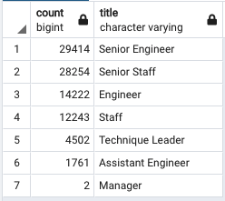
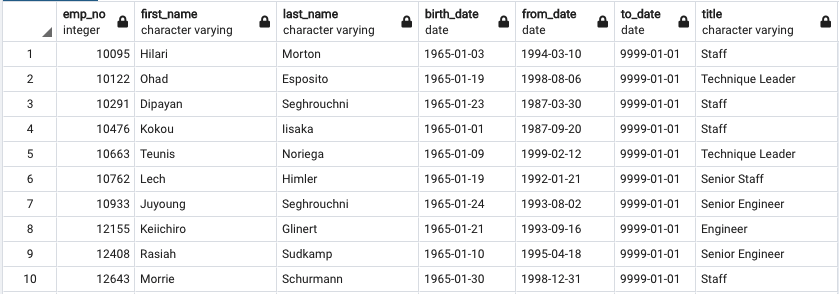

# Pewlett-Hackard-Analysis

## Overview of Analysis
We were tasked with find the number of retiring employees for each position 
(title). We were also tasked with identifying the employees who will be able to 
participate in a mentorship program. 

## Results
From the Retiring Titles table we can see that:
* There is a very high number of employees that can retire at any time
* 29,415 Senior Engineers
* 32, 452 Staff 
* 14,221 Engineer
* 8,047 Senior Staff
* 4,502 Technique Leader
* 1,761 Assistant Engineer

## Summary
Answers to questions:
1. When you add the sum of all the retiring titles there are 90,398 roles that
need to be filled
1. There are not enough employees to participate in the mentorship program as we
only have 1549 eligble employees

